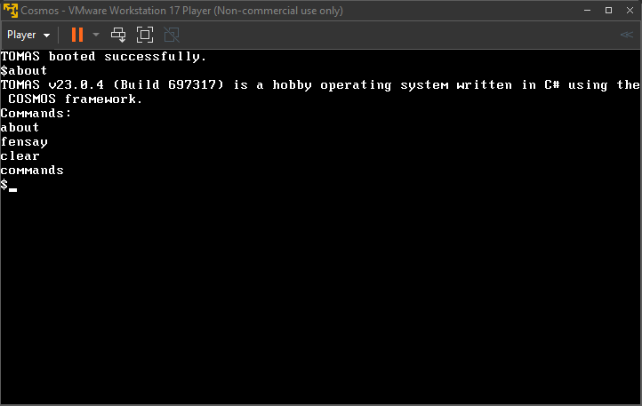

# TOMAS

TOMAS (**To**ny's **Ma**naged Operating **S**ystem) is a hobby operating system based on the [COSMOS](https://github.com/CosmosOS/Cosmos) framework that comes with a respective terminal emulator.

## Requirements

### Prerequisites

- Windows 10 or later
- Visual Studio 2022
- .NET 6 or later
- COSMOS User Kit v2022 or later
- VMWare Workstation Player

## License

In jurisdictions that recognize copyright waivers, I've [waived all copyright](UNLICENSE) and related or neighboring rights for to this project. In areas where these waivers are not recognized, [BSD-3-Clause](LICENSE) is enforced.
